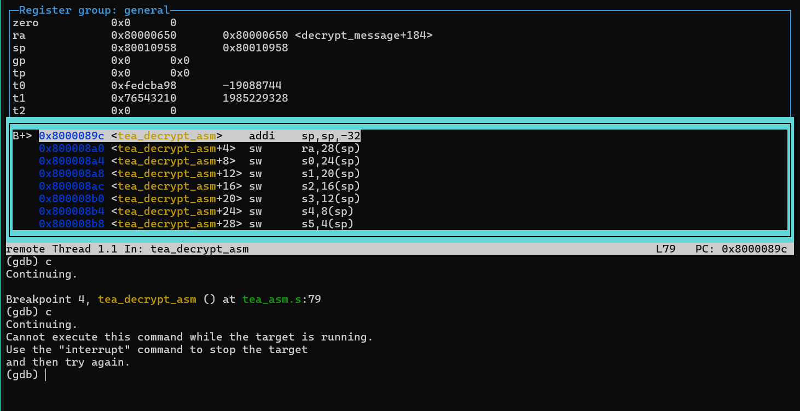
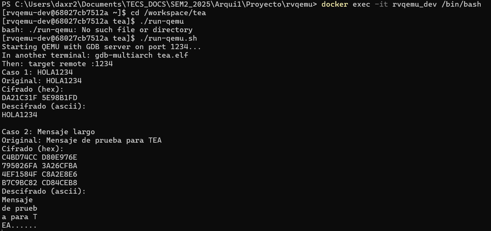

# Proyecto Individual: Cifrado TEA en RISC-V

Este proyecto implementa el algoritmo de cifrado TEA (Tiny Encryption Algorithm) en ensamblador RISC-V, integrándolo con un programa en C que gestiona la entrada/salida y el manejo de cadenas. Se ejecuta usando QEMU y un contenedor Docker preparado para RISC-V.

## Archivos

- `tea_main.c`: Define los mensajes de entrada, convierte entre cadenas y bloques de 64 bits, llama a las funciones de cifrado y descifrado escritas en ensamblador, y muestra los resultados.
- `startup.s`: Código de inicio que configura la pila y llama a main(). Los programas C necesitan inicialización antes de ejecutar main()
- `tea_asm.s`: Implementación en ensamblador de RISC-V con funciones diseñadas para encriptar y decriptar una cadena de caracteres.
- `linker.ld`: Script de enlazado que define la memoria y punto de entrada
- `build.sh`: Script de compilación
- `run-qemu.sh`: Script para ejecutar QEMU

## Funcionalidad

### Programa en C (`tea_main.c`)
- Función principal que llama a la función en ensamblador
- Funciones básicas para imprimir texto y números
- Llama a las funciones de cifrado y descifrado escritas en ensamblador.

### Código de inicio (`startup.s`)
- Establece el puntero de pila (sp) al inicio del área de pila definida en linker.ld
- Llama a la función main() del programa C
- Proporciona un bucle infinito si main() retorna, evitando que el programa termine inesperadamente

### Función en Assembly (`tea_asm.s`)
- `tea_encrypt_asm`: cifra un bloque de 64 bits usando una clave
    de 128 bits.
- `tea_decrypt_asm`: descifra un bloque de 64 bits usando la misma clave.
- Ambas funciones siguen las convenciones de llamada RISC-V.

## Compilación y ejecución

```bash
# (Terminal 1) En caso de NO tener ningún contenedor montado
docker run -it --name rvqemu_dev -v ${PWD}:/workspace rvqemu /bin/bash

# En caso de tener contenedor montado
docker exec -it rvqemu_dev /bin/bash

# Acceder al directorio del proyecto
cd /workspace/tea

# Compilar (Si no se ha hecho antes)
./build.sh

# Ejecutar con QEMU 
./run-qemu.sh

# (Terminal 2) En otra terminal, conectar GDB 
docker exec -it rvqemu_dev /bin/bash
cd /workspace/tea
gdb-multiarch tea.elf
```

## Depuración con GDB

### Script automatizado de depuración
Para facilitar la depuración, puede usar los comandos archivo `debug_test.gdb`:

```bash
# En una terminal: iniciar QEMU
./run-qemu.sh

# En otra terminal: ejecutar script de GDB
docker exec -it rvqemu_dev /bin/bash
cd /workspace/tea
gdb-multiarch tea.elf 
```

Comandos de gdb en `debug_test.gdb`:
```gdb
target remote :1234

break _start
break main
break tea_encrypt_asm
break tea_decrypt_asm

layout asm
layout regs

continue

step
step

info registers

continue

```

O tambien puedes ejecutar antes de iniciar la terminal gdb

```gdb
gdb-multiarch -x debug_test.gdb tea.elf
```
Para seguir al siguiente paso de los ejemplos, puedes escribir "c" en la terminal

## Convenciones de llamada RISC-V

- `a0`: Primer parámetro de entrada y valor de retorno
- `a1-a7`: Parámetros adicionales
- `s0-s11`: Registros salvados (preserved)
- `t0-t6`: Registros temporales
- `ra`: Dirección de retorno
- `sp`: Puntero de pila

- `a0`--`a7`: Parámetros
- `a0` (y `a1` si son 64 bits): Valor de retorno
- `s0-s11`: Registros salvados
- `t0-t6`: Registros temporales
- `ra`: Dirección de retorno
- `sp`: Puntero de pila


Las funciones `tea_encrypt_asm` y `tea_decrypt_asm` respetan estas
convenciones:\
1. Guardan registros en la pila
2. Usan parámetros desde `a0`-`a3`
3. Devuelven los resultados en `a0`-`a1`
4. Restauran registros antes de `ret`

## Evidencias de funcionamiento
### Salida de terminal GDB 


En esta imagen se observa la terminal de GDB conectado a QEMU despues de haber ejecutado ambos casos de pruebas, con dos layouts activos, uno de ellos es el layout activo de registros (layout superior), el cual se activó gracias a que se corrió el comando "layout regs", en donde se pueden observar los registros generales del procesador RISC V, entre ellos se observan los registros ra (direccion de retorno), sp (puntero de pila actual), y tambien los registros temporales (t0, t1, t2). Este layout es útil para observar cómo cambian los registros en tiempo real cada vez que se avanza con el comando "c" o "continue".
Además, tambien se puede observar el layout de ensamblador (layout inferior), este layout se encuentra activo gracias a que se corrió el comando "layout asm", aqui se muestran las instrucciones de máquina desensambladas en la función actual (tea_decrypt en este caso). La utilidad de este layout se centra en que da el contexto exacto de las instrucciones que se están ejecutando en el momento, sin necesidad de abrir el código desarrollado.

### Salida en terminal QEMU después de correr las pruebas


Aqui se observa la salida en terminal en donde se ejecutó ./run-qemu.sh, y se imprimen los resultados de las dos pruebas definidas en tea_main.c.
Para cada una de las pruebas se muestra el mensaje original, el cifrado en hexadecimal (mostrado en bloques de 64 bits), y el decifrado en ASCII (en la segunda prueba se muestra dividido en bloques de 8 caracteres por el esquema de padding, visualizandose en el ultimo bloque el relleno por padding mediante el uso de puntos). La salida de QEMU valida la correcta implementación del algoritmo TEA tanto en cifrado como descifrado de mensajes cortos y largos.
